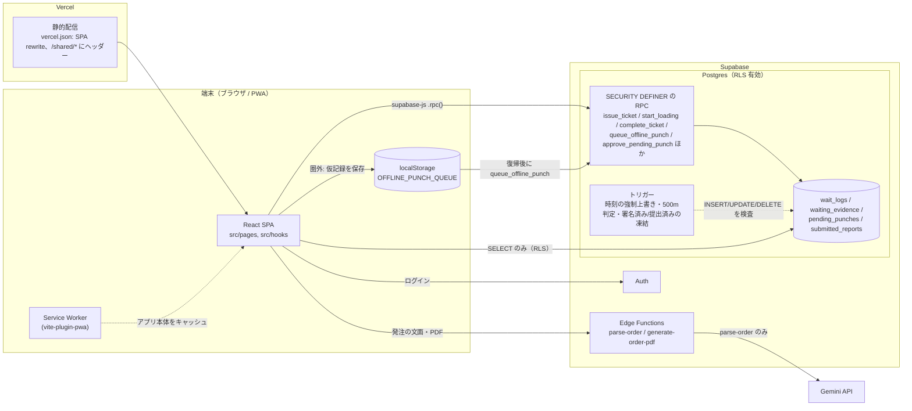
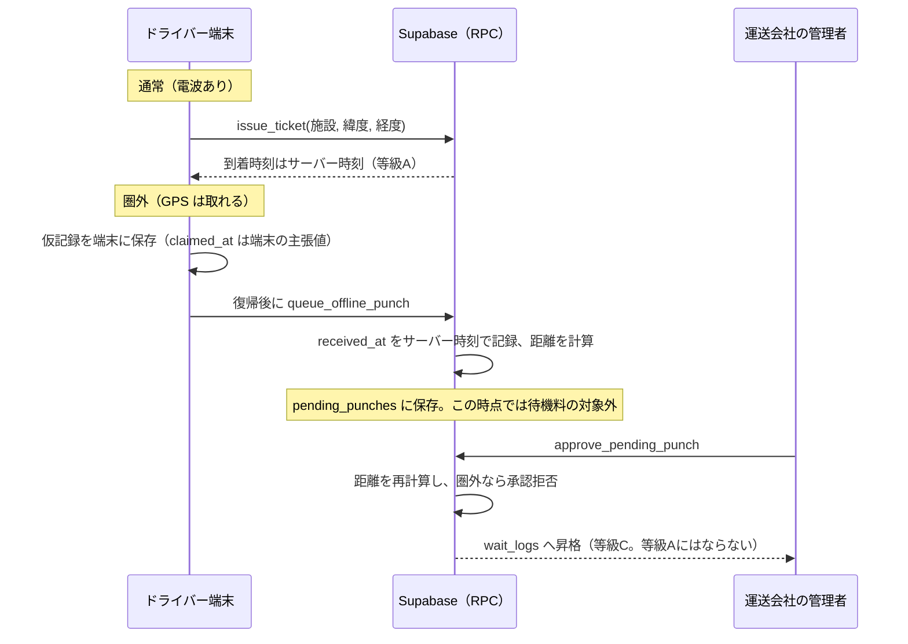

# 守護神（shugoshin-logbook）

> **In short.** A web app that lets truck drivers record waiting time at shipper facilities as evidence that is hard to tamper with, so carriers can bill waiting fees on solid ground.
> The core idea is "never trust the client": timestamps come from the DB server, evidence tables are writable only through `SECURITY DEFINER` RPCs, and signed or submitted records are frozen by triggers.
> Stack: React 18 / Vite / TypeScript / Tailwind / shadcn-ui on Vercel, Supabase (Auth, Postgres + RLS, Edge Functions). It is a one-person project at demo stage and has not been used in real operation yet.
> The best place to start is the public demo (no login, fictional data, no DB connection): <https://shugoshin-logbook.vercel.app/demo>

以下は日本語で書いています。設計判断の理由は [設計判断と理由](#設計判断と理由) にまとめました。

---

## 課題: 誰のどんな困りごとか

- **トラックドライバーと運送会社**: 荷主の施設（市場・港湾など）で長く待たされても、その時間を示す客観的な記録が無く、待機料を請求しづらい。
- **水産物流（山口県下関を想定）**: 市場や港湾は電波状況が悪い。電波が無いと打刻できないアプリでは、待機の証拠が残らない。水産流通適正化法の漁獲番号など、書面に載せる情報の入力もある（対象魚種は限られる。詳細は [`docs/CONTEXT_FISHERY_LAW.md`](./docs/CONTEXT_FISHERY_LAW.md)）。
- **取適法（中小受託取引適正化法）**: 発注時の書面（4条書面）の必須項目や、支払期日の上限（受領日の59日後）といった取引条件の記録が要る。条文メモは出典つきで [`docs/CONTEXT_LEGAL_SPEC.md`](./docs/CONTEXT_LEGAL_SPEC.md) にあります。
- **荷主**: 争いになったとき、「どの記録が、どれだけ信頼できるのか」を見分けられる形で提示されたい。

この記録を請求の根拠にするには、**記録する側（端末）を信用しない**ことが前提になります。このリポジトリはその設計の実装です。

## 触れる場所

本番（Vercel）: <https://shugoshin-logbook.vercel.app>。公開しているのは `/demo` 系の4画面だけです。ログイン不要・架空データで、**DB には接続しません**（`src/pages/Demo.tsx` は supabase を使わない）。

| パス | 見られるもの |
|---|---|
| [`/demo`](https://shugoshin-logbook.vercel.app/demo) | ドライバーの1日。GPS と500mジオフェンス、打刻タイムライン、待機料の算定、荷主側の待機状況の画面、日報の提出（1秒の長押し→「提出済み・変更不可」。修正を試すと拒否される） |
| [`/demo/orders`](https://shugoshin-logbook.vercel.app/demo/orders) | 発注の流れ。例文を選ぶ→（擬似の）AI 解析→必須項目の確認→承認（取り消し不可）→4条書面。項目が欠けたままの承認は拒否される |
| [`/demo/report`](https://shugoshin-logbook.vercel.app/demo/report) | 荷主に渡す報告書。サーバー検証済（等級A）と管理者承認済みの申告（等級C）を区別して表示。A4 で印刷できる |
| [`/demo/warning`](https://shugoshin-logbook.vercel.app/demo/warning) | 荷主別の警告レポート（1か月分の待機リスク診断） |

デモの AI 解析は固定の結果を返す擬似実装です。本番画面（`/orders`）では Edge Function `parse-order` が Gemini API を呼びます。

## 構成図



オフライン打刻の流れ（設計の全文は [`docs/DESIGN_OFFLINE_PUNCH.md`](./docs/DESIGN_OFFLINE_PUNCH.md)）:



## 設計判断と理由

方針は「記録の強さを偽らない」です。端末は信用せず、サーバーが確かめられないものは確かめられないと明示します。以下の5つを、実際のファイルで示します。

### ① サーバー時刻を証拠にする（クライアント時刻を信用しない）

- **何をしたか**: `wait_logs.arrival_time`・`waiting_evidence.recorded_at`・`submitted_reports.submitted_at` などを、INSERT 時のトリガーで `CURRENT_TIMESTAMP` に強制上書きする（`20260414000003_force_server_timestamps.sql` の `force_wait_log_arrival_time` / `trg_force_wait_log_arrival`、`20260414000007_create_waiting_evidence.sql` の `trg_force_waiting_evidence_timestamps`、`20260414000005_immutable_submitted_reports_trigger.sql` の `trg_force_submitted_at`）。荷役開始・完了の時刻も RPC 内でサーバーが付ける（`start_loading`、`complete_ticket`）。
- **なぜ**: 端末の時計は書き換えられる。待機料の根拠になる時刻を端末から受け取る経路が1つでもあれば、そこが偽装の入口になる。
- **捨てたもの**: 圏外で貯めた打刻の時刻を、そのまま信頼する簡便さ。圏外の打刻は `pending_punches` に「申請」として入り、端末の主張時刻 `claimed_at` は上書きせず別に保持する。サーバーが言えるのは「受信時刻より前」という上界だけなので、管理者の承認を経て **等級C**（等級Aとは区別して表示）になる（`20260730100000_create_pending_punches.sql`、`20260731100000_approve_pending_punches.sql`）。強制上書きトリガーに承認用の例外を開ける案は、将来の偽装経路になるため採らなかった（`docs/DESIGN_OFFLINE_PUNCH.md` §8 決定①）。

### ② 証拠系テーブルへの書き込みは SECURITY DEFINER の RPC だけ

- **何をしたか**: `wait_logs` / `waiting_evidence` / `pending_punches` から `authenticated` の INSERT/UPDATE/DELETE を REVOKE し、書き込みは `issue_ticket` / `start_loading` / `complete_ticket` / `cancel_ticket` / `queue_offline_punch` / `approve_pending_punch` などの RPC だけにした。関数は既定で誰も実行できず、必要なロールにだけ `GRANT EXECUTE` する（`20260806110000_lock_down_writes_and_rpc_grants.sql` の `ALTER DEFAULT PRIVILEGES ... REVOKE EXECUTE`）。圏外の打刻は、`wait_logs` への INSERT 時トリガー `enforce_wait_log_geofence`（Haversine 式）が経路を問わず拒否する（`20260720130000_enforce_wait_log_geofence_rls.sql`）。
- **なぜ**: 以前は RLS ポリシーだけで守っており、`user_id = auth.uid()` を満たせば座標・ステータス・整理券番号を自由に INSERT できた。Supabase は `authenticated` にテーブル単位の権限を既定で付与するため、列単位の REVOKE も効かなかった（同 migration と `docs/CONTEXT_SUPABASE.md`）。
- **捨てたもの**: クライアントから `.insert()` する手軽さ。新しい書き込み口は、RPC を書き、`GRANT` を足す手間がかかる。権限を絞ったときに正規の RPC まで壊す事故も実際に起きた（`20260728130000_fix_issue_ticket_gps.sql` の冒頭に、到着打刻が必ず失敗していた経緯を記録している）。

### ③ RLS ファースト ＋ `security_checks.sql`

- **何をしたか**: 全テーブルに RLS を有効化し、変更のたびに `supabase/tests/security_checks.sql` を実行する。正規フロー（到着→荷役開始→完了）が通ることと、直接 INSERT・状態の巻き戻し・権限のない荷主操作・未ログインでの RPC 実行・招待コードの総当たり・共有リンクの発行権限と失効が**拒否される**ことを確かめる。結果は例外メッセージとして返り、**必ずロールバックされる**。2026-10-04 時点の本番で全13項目 `[OK]`（`STATUS.md` §4）。
- **なぜ**: 権限設計は、1行の GRANT や1つのポリシーの追加で静かに崩れる。崩れていないことを、毎回同じ手順で確認できる形にした。
- **捨てたもの**: CI での自動実行。DB（認証済みユーザー・施設データ）が要るため、**CI では動かしていません**。手元でも、この開発機には Docker・`supabase` CLI・`psql` が無く、SQL Editor に貼って手動で実行しています（`STATUS.md` §2c）。

### ④ 承認済み・提出済みの改ざん防止（トリガー）

- **何をしたか**: 署名済みの `waiting_evidence` は更新・削除・TRUNCATE を全ロールで禁止（`trg_guard_waiting_evidence_update`、`trg_block_waiting_evidence_delete`、`trg_block_waiting_evidence_truncate`）。署名は `complete_ticket` が完了時に行う（`20260720140000_sign_waiting_evidence_on_complete.sql`）。`submitted_reports` は `trg_block_submitted_reports_update` / `_delete` / `_truncate` で凍結。承認済みの発注（4条書面）は `guard_transport_orders` トリガーで内容・納期・温度帯の変更と削除を禁止し、承認の日時・承認者もサーバー側で付与する（`20260806170000_freeze_approved_orders.sql`）。打刻の取消は物理削除ではなく状態の変更だけ（`20260728100000_cancel_ticket_rpc.sql`）。
- **なぜ**: RLS は `service_role` や DB 管理者の接続ではバイパスされる。トリガーは全ロールに効く（`20260414000005` の冒頭コメントに二重防御の考え方がある）。
- **捨てたもの**: 後からの訂正。間違いがあっても書き換えられず、新しい記録で補うしかない。提出時の内容が誤っていても、そのまま固定される（下の「既知の課題」の最初の項目がまさにこれ）。

### ⑤ オフライン優先（打刻の主経路に通信必須の機能を置かない）

- **何をしたか**: 圏外では GPS だけで取れる座標を端末に仮記録し、復帰後（オンライン復帰イベントと次回起動時）に `queue_offline_punch` で送る（`src/lib/offlinePunchQueue.ts`、`src/hooks/useOfflinePunch.ts`）。再送で二重申請にならないよう、端末で冪等キーを発番する。`navigator.onLine` は「圏外ギリギリ」で true のままになるので、打刻 RPC の通信失敗も圏外の条件に含める（`src/hooks/useOnlineStatus.ts` の注意書き）。アプリ本体は `vite-plugin-pwa` でキャッシュする（`vite.config.ts`）。水産物情報の入力は、通信が要る AI-OCR を主経路にせず、漁獲番号を構造分解して下3桁（ロット番号）だけ入力する方式にした（`docs/CONTEXT_FISHERY_LAW.md` §3-1）。
- **なぜ**: 打刻できない＝待機の証拠が残らない＝請求できない、になるため。しかも、圏外で失われるのは位置ではなく「時刻の信頼性」だけだという整理（`docs/DESIGN_OFFLINE_PUNCH.md` §1）から、全部を拒否する従来の設計は過剰だと判断した。
- **捨てたもの**: 圏外の記録を即座に請求根拠にすること（承認までは待機料の対象外）、座標も取れない場合の記録（位置の裏付けが無い申告は受けない）、AI による入力補助を打刻の主経路に置くこと。iOS Safari は Background Sync 非対応のため、バックグラウンド送信もできない（復帰イベントと次回起動での送信で妥協）。

## テストと CI

2026-10-06 に `npx vitest run` を実行した結果は **17 ファイル・143 件・すべて成功** です。

| 種類 | ファイル | 件数 |
|---|---|---|
| ドメインロジック（純粋関数） | `src/lib/*.test.ts` 9本（発注内容、水産法の対象判定、日報の時刻算定、支払期日、JST の日付、認証・DB エラーの文言ほか） | 99 |
| 打刻の結合（Supabase をモック） | `src/hooks/useEvidence.test.ts`、`src/components/evidence/EvidenceCollector.test.tsx` | 15 |
| 画面（`/demo` 系） | `src/pages/DemoOrders.test.tsx`、`src/components/demo/DemoSubmitPanel.test.tsx`、`src/components/report/RiskReportDocument.test.tsx` | 18 |
| デモのデータ | `src/demo/demoData.test.ts`、`src/demo/demoMonthlyReport.test.ts` | 10 |
| プレースホルダ | `src/test/example.test.ts`（`expect(true)` だけ） | 1 |

CI は [`.github/workflows/shugoshin-ci.yml`](../.github/workflows/shugoshin-ci.yml)（リポジトリ直下）。`npm ci` → 型チェック（`npx tsc --noEmit -p tsconfig.app.json`）→ `npx vitest run` → `npm run build` を、push と pull request で実行します。シークレットは使わず、ビルド用の環境変数はダミー値です。

**CI で確かめていないこと（正直に）**:
- DB 側（RPC・トリガー・RLS）は、自動テストが無く、`security_checks.sql` を手動で実行している。
- ESLint は CI に含めていない。
- 実機（GPS・圏外・iOS の PWA）での打刻は未検証（`docs/PROGRESS_LOG.md`）。

## 既知の課題・次にやること

詳細と最新の状態は [`STATUS.md`](./STATUS.md)（§2d、§3）。ここでは技術者に関係するものを挙げます。

- **提出時に帳票の中身を端末が決めている（最大の課題）**。`DailyReportConfirm.tsx` が `submitted_reports` へ直接 INSERT し、`timeline_snapshot`・`total_wait_minutes`・`estimated_wait_cost`・`formal_report` を端末から送る。提出後は書き換えられない（④のトリガー）が、偽の内容もそのまま固定され、荷主の共有帳票に「等級A：サーバー検証済」と出てしまう。サーバー側での再計算が未了。着手前に「日報が何を数えるか」（今は `wait_logs` に加え、旧 `compliance_logs` と音声日報の申告分も足している）を決める必要があり、案は2つある（BEFORE INSERT トリガーで再計算する小案／提出専用 RPC にして直接 INSERT を REVOKE する大案）。ローカルに DB 環境が無いので、本番へ出す前にロールバック付きの検査を別環境で通す。本番の `submitted_reports` は5件で、すべてテスト期のデータ。
- **重複行の疑い（未確認）**: 提出時に同じ待機が `timeline` に2回入る経路がありそう（`useDailyTimeline.ts` と `DailyReportConfirm.tsx`）。実際の共有帳票で確認できていない。
- **共有リンクの粒度**: 1本のリンクで、その日の全荷主の訪問が見える。荷主ごとに絞るかは未決。リンクの一覧・個別失効の画面、開封通知も未実装。`/shared/*` には `Referrer-Policy: no-referrer` などのヘッダーを足したが（`vercel.json`）、本番での効き目の確認は STATUS.md の手順待ち。
- **料率表がコード内の定数**（`src/lib/waitCostCalc.ts`）。DB 化と、算定のサーバー側への一本化が未了。
- **施設・組織の登録 UI が無い**（SQL シードで運用）。荷主による施設の所有確認も未実装。
- **取適法の4条書面**: 発注先（中小受託事業者）の名称を発注データに持たせていない（必須項目）。法務の目通しも未了。発注書 PDF の Edge Function の最新版は 2026-10-06 に本番へデプロイ済み。ただし、承認済みの発注で出した PDF の実描画の目視は未了（STATUS.md §2c）。
- **使っていないコード**: Edge Function `parse-daily-report` は、現行のフロントから呼ばれていない。
- **実運用の実績はほぼ無い**。デモに向けた作り込みの段階で、本番 DB のデータはテスト期のものが中心（`docs/PROGRESS_LOG.md` 2026-10-04）。
- 規模・履歴の事情: 初期の migration は Lovable の生成物で、ファイル名が UUID（`supabase/migrations/README.md`）。一部は SQL Editor 経由で適用したため、履歴の記録を後から補正した（`docs/PROGRESS_LOG.md`）。フロントは単一の JS バンドル（約 917 kB）で、コード分割はしていない。

## 開発の始め方

```sh
npm ci                  # 依存関係（CI と同じ）
cp .env.example .env    # 値は自分の Supabase プロジェクトのものを入れる
npm run dev             # 開発サーバー（ポート 8080）
```

| 環境変数 | 内容 |
|---|---|
| `VITE_SUPABASE_URL` | Supabase プロジェクトの URL |
| `VITE_SUPABASE_PUBLISHABLE_KEY` | 公開キー。**`service_role` キーは入れない**（旧名の `ANON_KEY` では効きません） |

```sh
npx tsc --noEmit -p tsconfig.app.json   # 型チェック
npx vitest run                          # テスト
npm run build                           # 本番ビルド
```

- ルートの `tsconfig.json` は `files: []` なので、`tsc --noEmit` だけでは何も検査されません。`npm run build` も型を検査しません。型チェックは必ず `-p tsconfig.app.json` で行います。
- `/demo` 系は、環境変数が無くても動きます（DB に接続しないため）。
- DB は `supabase/migrations/` で管理し、コンソールからの直接変更はしません。変更後は `supabase/tests/security_checks.sql` を実行して全項目 `[OK]` を確認します（規約は [`CLAUDE.md`](./CLAUDE.md)）。
- Edge Function `parse-order` / `parse-daily-report` には、Supabase 側のシークレットとして `GEMINI_API_KEY` が必要です。

## ディレクトリとドキュメント

```
src/pages/            画面（Demo*, CheckIn, AdminDashboard, PendingPunches, SharedReportView ...）
src/hooks/            useEvidence（打刻）, useOfflinePunch, useAuth ...
src/lib/              算定・変換のロジック（単体テスト付き）
src/demo/             /demo 用の架空データ
supabase/migrations/  スキーマ・RLS・RPC・トリガーの変更履歴（58本）
supabase/functions/   Edge Functions（parse-order, parse-daily-report, generate-order-pdf）
supabase/tests/       security_checks.sql（権限の回帰テスト）
docs/                 設計メモ・実装要約・進捗ログ
```

| ドキュメント | 内容 |
|---|---|
| [`docs/CONTEXT_SUPABASE.md`](./docs/CONTEXT_SUPABASE.md) | DB 設計の原則、テーブルごとの読める人・書き込みの入口 |
| [`docs/DESIGN_OFFLINE_PUNCH.md`](./docs/DESIGN_OFFLINE_PUNCH.md) | オフライン打刻と証拠の等級（A/B/C）の設計、不採用にした案 |
| [`docs/CONTEXT_LEGAL_SPEC.md`](./docs/CONTEXT_LEGAL_SPEC.md) | 取適法の条文メモ（出典つき） |
| [`docs/CONTEXT_FISHERY_LAW.md`](./docs/CONTEXT_FISHERY_LAW.md) | 水産流通適正化法（漁獲番号・対象魚種）と未解決の照会事項 |
| [`docs/IMPLEMENTATION_SUMMARY.md`](./docs/IMPLEMENTATION_SUMMARY.md) | 実装要約（2026-04 時点。以降の変更は `PROGRESS_LOG.md`） |
| [`docs/PROGRESS_LOG.md`](./docs/PROGRESS_LOG.md) | 修正の経緯・設計判断のログ |
| [`STATUS.md`](./STATUS.md) | 現在地と次の一手 |
